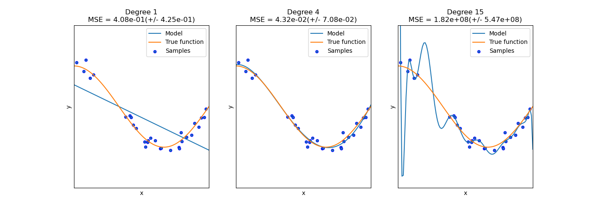
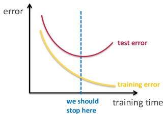

# Cats VS Dogs Dataset

can download from [kaggle](https://www.kaggle.com/c/dogs-vs-cats/data)
or use ```tensorflow_dataset```. How to use from dataset library:

```python
import tensorflow_datasets as tfds

dataset_name='cats_vs_dogs'
train_dataset = tfds.load(name=dataset_name, split='train[:80%]') # load with split
valid_dataset = tfds.load(name=dataset_name, split='train[80%:]') # split to train and valid set.
```

Read [guide page](https://www.tensorflow.org/datasets/overview) to see details.

Or use dataset from [here](https://www.microsoft.com/en-us/download/details.aspx?id=54765).

---

## Train / Validation / Test Set

Split dataset above to:

1. Train set
2. Validation Set
3. Test Set

(use python script [```0_Split_dataset.py```](0_Split_dataset.py))

Train Set:
* is dataset to learning model
* **Only Train Dataset is used to learning model**

Validation Set:
* is dataset to validate model learned already
* **is used for validating model while learning** (validate whether updating model decreases error on not only train set **but also unseen data**)
* **does not update model, but intervenue**

Test Set:
* is dataset to evaluate final model learned through neural network
* **is used for only final evaluation after learning.** (evaluate how realiable this model is)

### Reason why validation set is needed
Both validation set and test set are not used for updating model. Then why validation set is required?


(from https://scikit-learn.org/stable/auto_examples/model_selection/plot_underfitting_overfitting)

* Left: underfitted data
* Middle: fitted well (closest to ideal)
* Right: overfitted data

As increasing epochs (left to right), the model gets fitted. But at some point, the model deviates from the ideal and gets overfitted. It learns not a pattern but a train set if it learns too much.

As we saw visually, the figure at the middle might fit well with not only the train set but also unseen data.

Thus, the problem falls into finding the point of being well fitted, where it should stop learning: blue baseline in below figure.



We can find that blue line by testing **comparative dataset**'s error in learning time.

Note that neither train set nor test set can be **comparative dataset**.

It should detect the blue line where the model is getting overfitted which cannot be detected by training error.

At the same time, the test set must not intervene in the learning process.

Thus, we need another dataset which is not a learning target but intervenes in the learning: Validation Set

By implementing validation set, model:
* prevents overfitting.
* guarantees on unseen data.

from [ganghee-lee.tistory.com](https://ganghee-lee.tistory.com/38)

# Transfer Learning: 전이학습
* is a technique that use pre-trained model to learn another new model.
* eg. VGG, Resnet, etc...
* Those well-pretrained neural networks were already designed to extract feature from image in most optimized way. (Developed by leading researcher in ML/DL)


Above figure is sturcture of VGG16.

How to use VGG16 using ```tensorflow.keras```:

in [```5_VGG16_Train.py```](5_VGG16_Train.py)
```python
# Build Model using VGG16 as convolutional layer base
conv_base = VGG16(weights='imagenet', include_top=False, input_shape=(150, 150, 3))

model = models.Sequential()
model.add(conv_base)
model.add(layers.Flatten())
model.add(layers.Dense(256, activation='relu'))
model.add(layers.Dense(1, activation='sigmoid'))
conv_base.trainable = False # Do not change weights while training
print(model.summary())
```