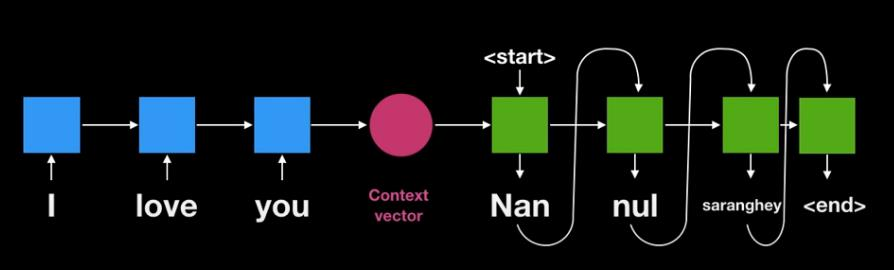
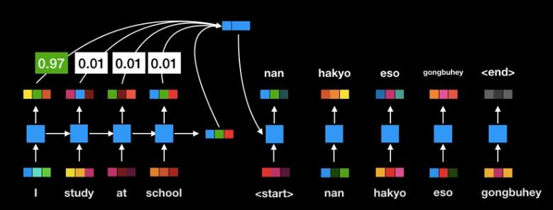
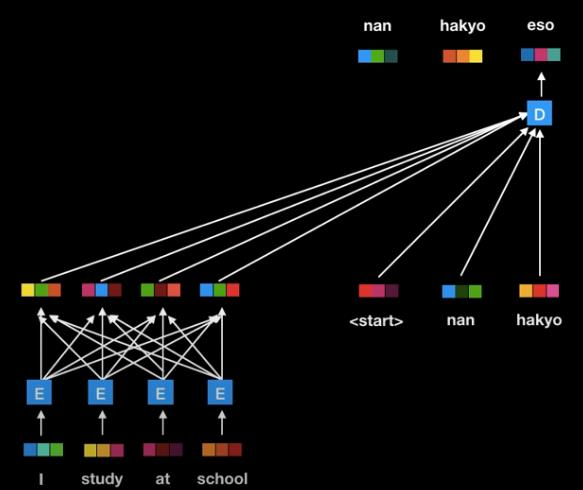
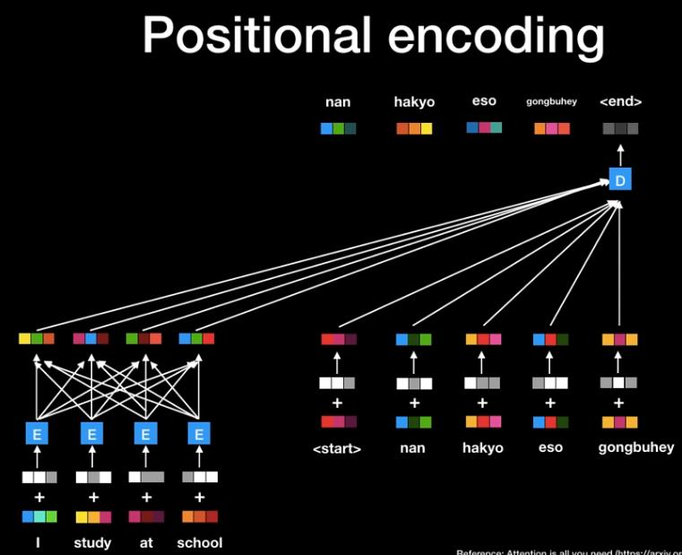
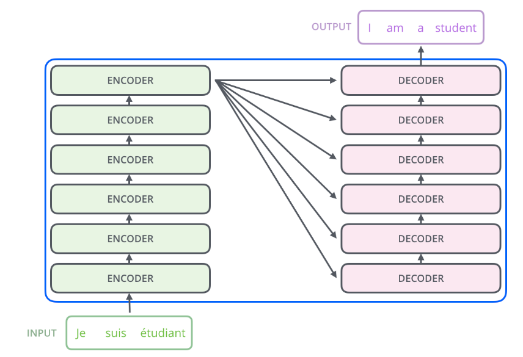

# Seq2seq Model
* is used for translator or chatbot
* It is possible to develop translator using LSTM, but more efficient '**attention model**' was developed in 2015.
* **Word order should be considered** because it is awkward translating word by word.
* **RNN is not proper for seq2seq models** such as translator or chatbot.
* When creating context vector that compresses sentence such as "how are you?" in RNN, the last input is involved more. (characteristic of RNN)
* In situations where inputs are all different lengths, using encoders of a certain size will make it difficult to express input information well.

eg.) 
- I love you → 나 사랑 너
- I love you → 나는 너를 사랑해

## attention
* 'attention' solves the problems mentioned above.
* 'attention' learns 'attention weight' that calculates which words should be considered important when outputting additionally to the RNN model.
* In the figure below, the result "난" puts more weight on input "I".
* The attention weight is learned separately for each output.
* The attention model has improved performance by complementing the shortcomings of RNN mentioned above, but there is still a computational time issue.

* In the figure below, RNN part is removed and each input vector is connected to an auto encoder model for each output word.
* By removing RNN, computational speed can be improved dramatically and each word can be learned separately.
* It is required to process the positional information of words, adding positional encoding value.

* Transformer is the model that succeeded in removing RNNs.
* Entered embedding vectors are converted into embedding vectors with meanings in sentences rather than a single word as they pass through the encoder.
* The final embedding vector is output through six encoders of the same structure, and the embedding vector is put into the decoder and converted into the final result in the same way.

* In 2018, Google announced a BERT(Bidirectional Encoder) model that transformed Transformers in both directions, which was the first model of human capability.
* Google is providing pre-studying Wikipedia sentences with BERT models.
* [yonghee.io](http://yonghee.io/bert_binary_classification_naver/) is a code that learns positive/negative about Naver movie comments through the koBERT model.

